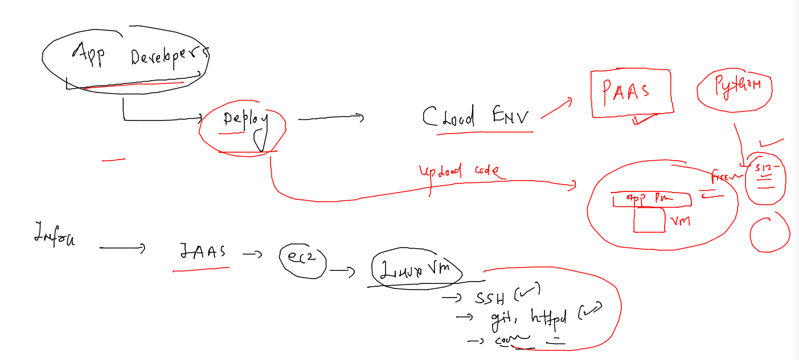
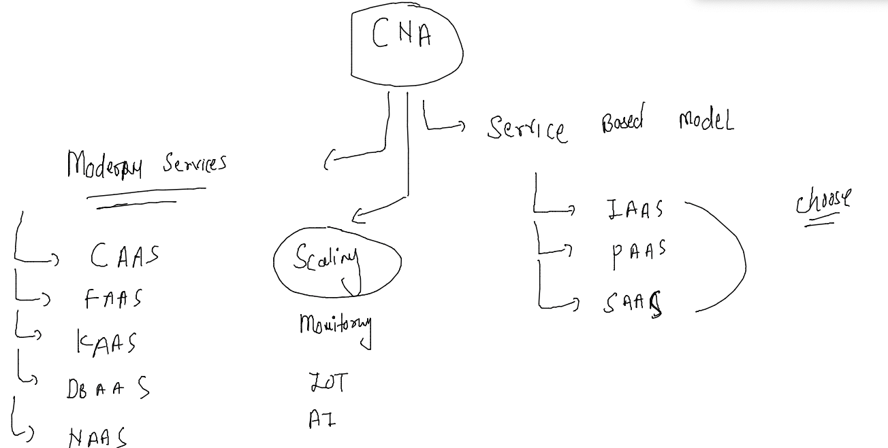
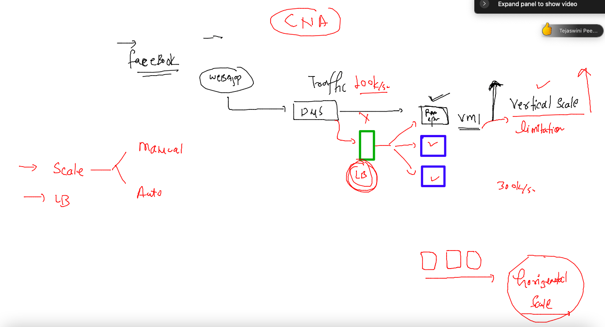
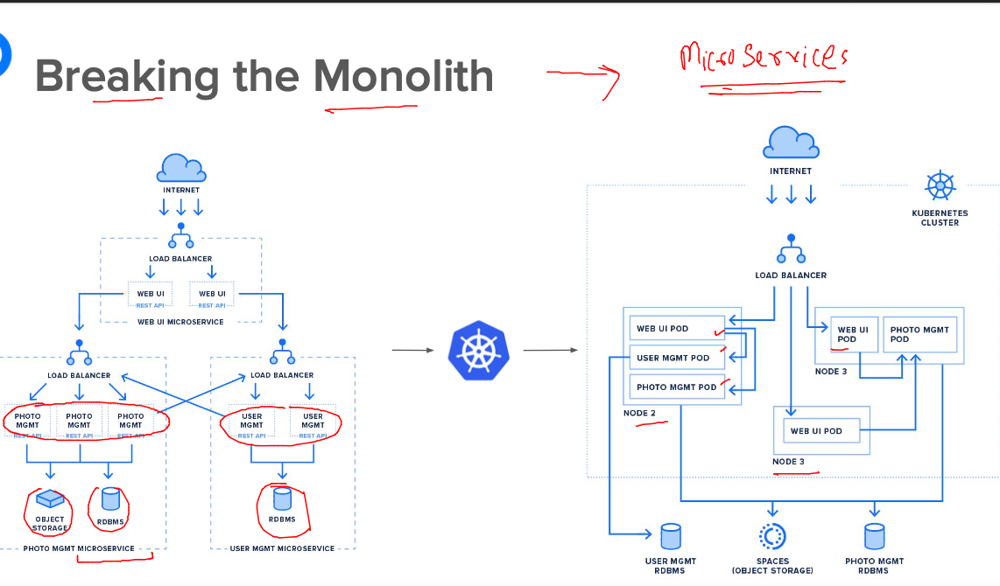
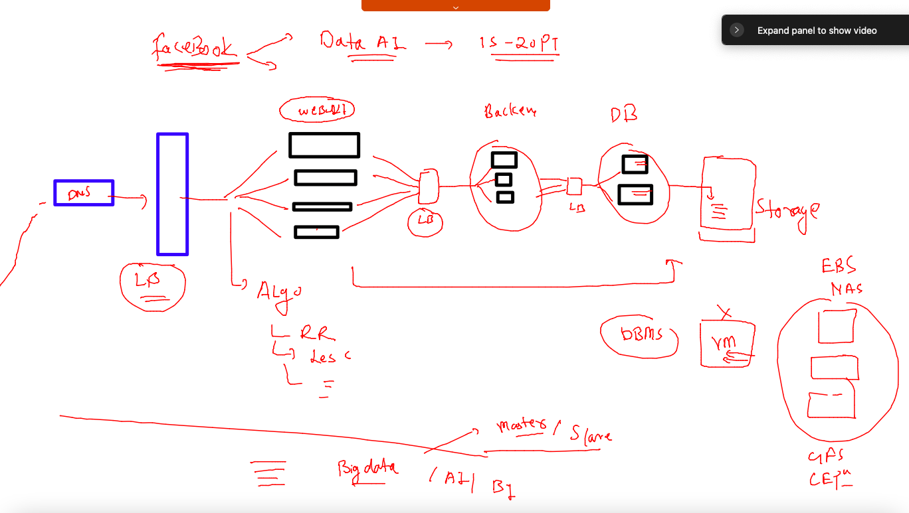
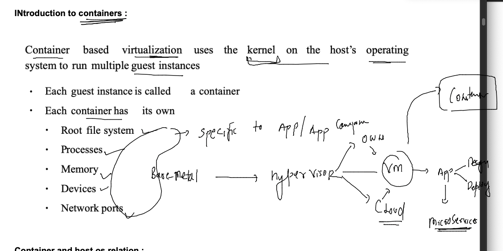
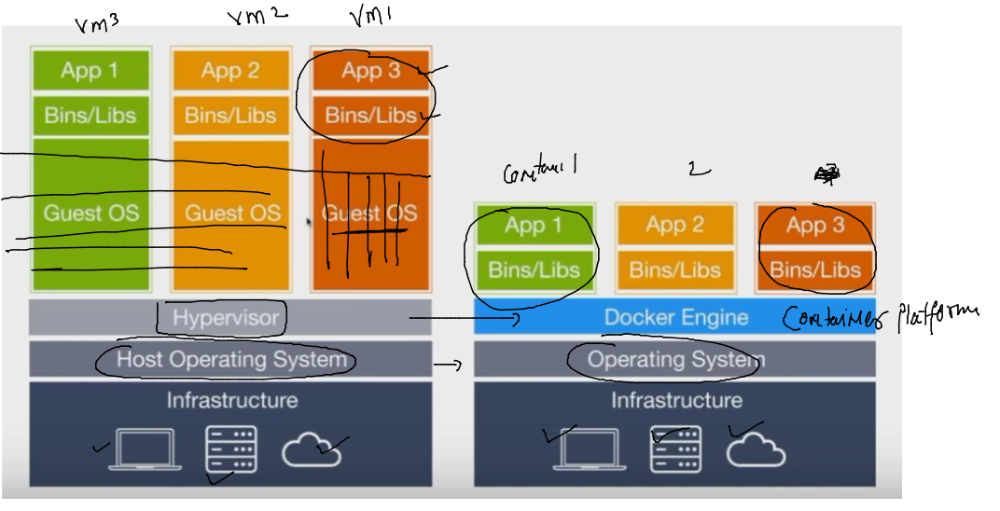
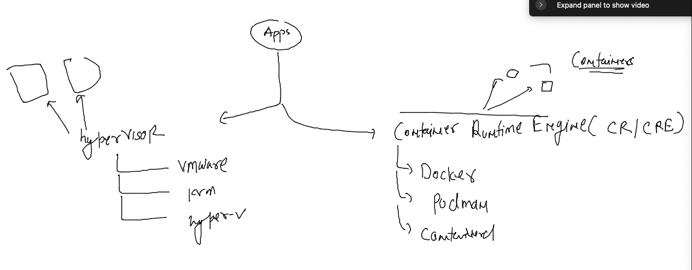

# cisco-CNA-22ndNov2022

## traning plan 


### journey 


### app deploy problem 


### app conflict problem 


### introduction to Hypervisor for VM concept 


### type 2 Hypervisor 


### type 1 hypervisor 


### infra and Hypervisor problems 


## Cloud Deployment model 


### Public cloud 


### private cloud model 


## Cloud Delivery Model 

### SAAS 


### PAAS 


### IAAS 


### planning and vm in aws cloud using Ec2 


### launched ec2 in aws cloud 

### lets connect using ssh from MAC 

### run this in the terminal 

```
fire@ashutoshhs-MacBook-Air ~ % ls  -l Downloads/ashu-cisco-key.pem 
-rw-r--r--@ 1 fire  staff  1674 Nov 22 12:27 Downloads/ashu-cisco-key.pem
fire@ashutoshhs-MacBook-Air ~ % 
fire@ashutoshhs-MacBook-Air ~ % 
fire@ashutoshhs-MacBook-Air ~ % 
fire@ashutoshhs-MacBook-Air ~ % chmod 400 Downloads/ashu-cisco-key.pem 
fire@ashutoshhs-MacBook-Air ~ % 
fire@ashutoshhs-MacBook-Air ~ % ls  -l Downloads/ashu-cisco-key.pem   
-r--------@ 1 fire  staff  1674 Nov 22 12:27 Downloads/ashu-cisco-key.pem
fire@ashutoshhs-MacBook-Air ~ % 
```

### now connecting 

```
fire@ashutoshhs-MacBook-Air ~ % ssh -i Downloads/ashu-cisco-key.pem  ec2-user@35.174.114.195 
The authenticity of host '35.174.114.195 (35.174.114.195)' can't be established.
ECDSA key fingerprint is SHA256:/bRp+A739JNNN8yhUVURb72ZAlRUT8GSitF2Gsrh1vk.
Are you sure you want to continue connecting (yes/no/[fingerprint])? yes
Warning: Permanently added '35.174.114.195' (ECDSA) to the list of known hosts.

       __|  __|_  )
       _|  (     /   Amazon Linux 2 AMI
      ___|\___|___|

https://aws.amazon.com/amazon-linux-2/
1 package(s) needed for security, out of 1 available
Run "sudo yum update" to apply all updates.
-bash: warning: setlocale: LC_CTYPE: cannot change locale (UTF-8): No such file or directory
[ec2-user@ip-172-31-89-133 ~]$ 
```

### lets check it 

```
fire@ashutoshhs-MacBook-Air ~ % ssh -i Downloads/ashu-cisco-key.pem  ec2-user@35.174.114.195 
Last login: Tue Nov 22 07:11:01 2022 from 103.59.75.139

       __|  __|_  )
       _|  (     /   Amazon Linux 2 AMI
      ___|\___|___|

https://aws.amazon.com/amazon-linux-2/
1 package(s) needed for security, out of 1 available
Run "sudo yum update" to apply all updates.
-bash: warning: setlocale: LC_CTYPE: cannot change locale (UTF-8): No such file or directory
[ec2-user@ip-172-31-89-133 ~]$ 
[ec2-user@ip-172-31-89-133 ~]$ 
[ec2-user@ip-172-31-89-133 ~]$ whoami
ec2-user
[ec2-user@ip-172-31-89-133 ~]$ uname 
Linux
[ec2-user@ip-172-31-89-133 ~]$ uname  -r
5.10.147-133.644.amzn2.x86_64
[ec2-user@ip-172-31-89-133 ~]$ sudo -i
[root@ip-172-31-89-133 ~]# whoami
root
[root@ip-172-31-89-133 ~]# exit
logout
[ec2-user@ip-172-31-89-133 ~]$ exit
logout
Connection to 35.174.114.195 closed.
```

### availability zone 


### deploy a sample customer webapp frontend app in aws cloud vm 


### after login to vm - steps to perform 

```
[ec2-user@ip-172-31-33-192 ~]$ history 
    1  sudo -i
```

###  install httpd and git to host app 

```
 1  yum install git httpd -y 
    2  history 
    3  git clone  https://github.com/schoolofdevops/html-sample-app.git
    4  ls
    5  cp -rf html-sample-app/*  /var/www/html/
    6  systemctl start httpd
    7  ls  /var/www/html/
```

### Understanding PAAS 



## More aBout CNA standards 



### CNA -- scaling and LB 



### Intro to Microservices -- a relief from Monolith -- Design 



### Micro services with infra design 



### Container intro 



### Containers are light weight and super fast 



### vm vs containers



## creating a webapp in a container and compare with VM 

### taking sample webapp code 

```
[ashu@ip-172-31-16-246 ~]$ git clone https://github.com/yenchiah/project-website-template.git
Cloning into 'project-website-template'...
remote: Enumerating objects: 1025, done.
remote: Total 1025 (delta 0), reused 0 (delta 0), pack-reused 1025
Receiving objects: 100% (1025/1025), 1.64 MiB | 23.97 MiB/s, done.
Resolving deltas: 100% (632/632), done.
[ashu@ip-172-31-16-246 ~]$ ls
project-website-template

```

### lets deploy this code to container 

```
[ashu@ip-172-31-16-246 ~]$ ls
project-website-template
[ashu@ip-172-31-16-246 ~]$ docker  run -itd --name ashuwebc1 -v  ~/project-website-template/:/usr/share/nginx/html -p 1234:80  nginx 
Unable to find image 'nginx:latest' locally
latest: Pulling from library/nginx
a603fa5e3b41: Pull complete 
c39e1cda007e: Pull complete 
90cfefba34d7: Pull complete 
a38226fb7aba: Pull complete 
62583498bae6: Pull complete 
9802a2cfdb8d: Pull complete 
Digest: sha256:e209ac2f37c70c1e0e9873a5f7231e91dcd83fdf1178d8ed36c2ec09974210ba
Status: Downloaded newer image for nginx:latest
92aaad48c877c9c0c16b49b14ac3d8713d5758013b83cf0794e5d2e343fc985a
[ashu@ip-172-31-16-246 ~]$ docker  ps
CONTAINER ID   IMAGE     COMMAND                  CREATED         STATUS         PORTS                                   NAMES
92aaad48c877   nginx     "/docker-entrypoint.…"   3 seconds ago   Up 2 seconds   0.0.0.0:1234->80/tcp, :::1234->80/tcp   ashuwebc1
[ashu@ip-172-31-16-246 ~]$ 

```

## app Containerization -- 


