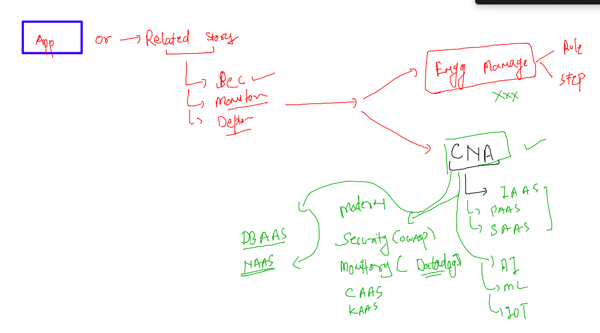
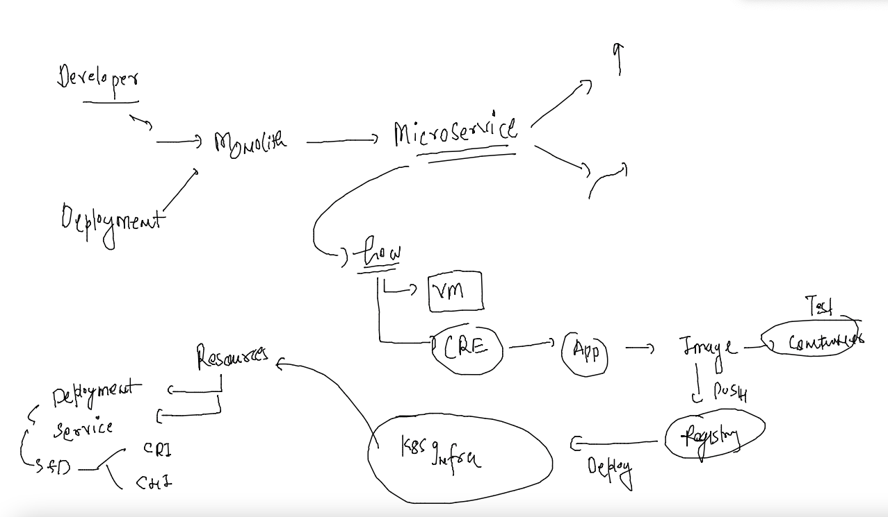
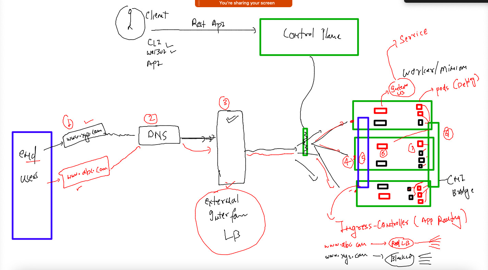

# cisco-CNA-22ndNov2022

## traning plan 


### revision step 1 



### REv step 2 



### k8s networking 



## Deploy app and implement Ingress rule 

### deploying app with UI 

```
[ashu@ip-172-31-16-246 ashu-container-apps]$ kubectl  create  deployment  ashu-app  --image=docker.io/library/adminer:latest --port 8080 --dry-run=client -o yaml >day
4app.yaml 
[ashu@ip-172-31-16-246 ashu-container-apps]$ kubectl  apply -f day4app.yaml 
deployment.apps/ashu-app created
[ashu@ip-172-31-16-246 ashu-container-apps]$ kubectl  get  deploy 
NAME       READY   UP-TO-DATE   AVAILABLE   AGE
ashu-app   1/1     1            1           5s
[ashu@ip-172-31-16-246 ashu-container-apps]$ kubectl  get  po 
NAME                      READY   STATUS    RESTARTS   AGE
ashu-app-f6cc5cd7-sptv6   1/1     Running   0          9s
[ashu@ip-172-31-16-246 ashu-container-apps]$ kubectl  get  po -o wide
NAME                      READY   STATUS    RESTARTS   AGE   IP                NODE      NOMINATED NODE   READINESS GATES
ashu-app-f6cc5cd7-sptv6   1/1     Running   0          14s   192.168.235.143   worker1   <none>           <none>
[ashu@ip-172-31-16-246 ashu-container-apps]$ 
```


