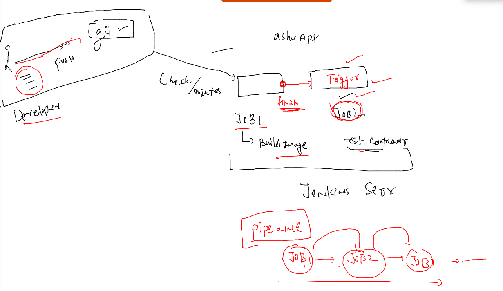
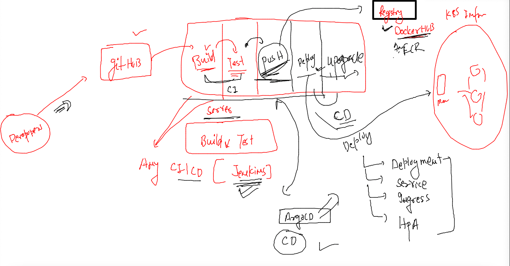
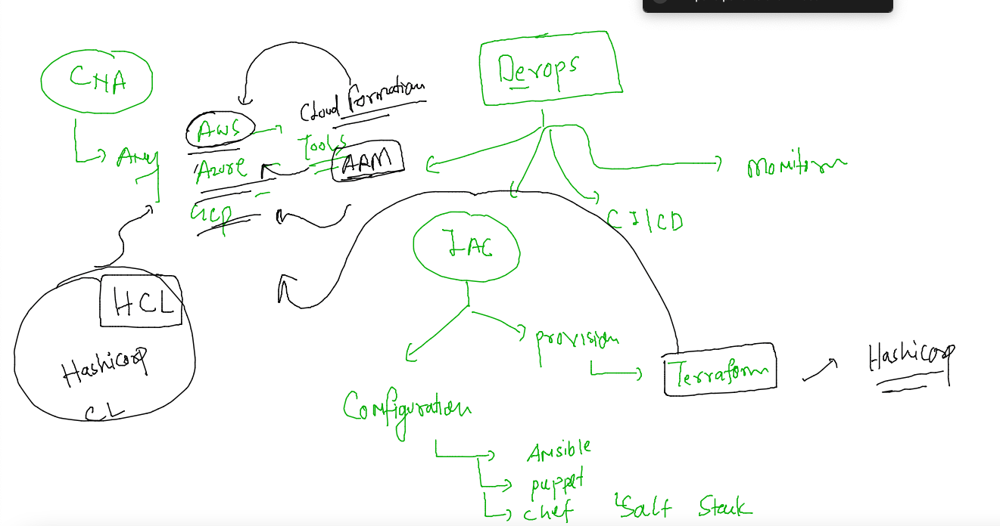

# cisco-CNA-22ndNov2022

## traning plan 


### testing automated Build of docker image on github code commit 

```
[ashu@ip-172-31-16-246 ashu-container-apps]$ cd  ashu-cisco-webUI/
[ashu@ip-172-31-16-246 ashu-cisco-webUI]$ ls
cicd.png  Dockerfile  health.html  index.html  README.md
[ashu@ip-172-31-16-246 ashu-cisco-webUI]$ git add . 
[ashu@ip-172-31-16-246 ashu-cisco-webUI]$ git commit -m "adding health check page"
[master 472b4ac] adding health check page
 1 file changed, 1 insertion(+)
 create mode 100644 health.html
[ashu@ip-172-31-16-246 ashu-cisco-webUI]$ git push 
Enumerating objects: 4, done.
Counting objects: 100% (4/4), done.
Delta compression using up to 2 threads
Compressing objects: 100% (3/3), done.
Writing objects: 100% (3/3), 333 bytes | 333.00 KiB/s, done.
Total 3 (delta 1), reused 0 (delta 0), pack-reused 0
remote: Resolving deltas: 100% (1/1), completed with 1 local object.
To https://github.com/redashu/ashu-cisco-webUI.git
   3c4527a..472b4ac  master -> master
[ashu@ip-172-31-16-246 ashu-cisco-webUI]$ 

```


### jenkins container app testing job content 

```
docker rm ashuapptest -f  &>/dev/null
docker run -d --name ashuapptest -p 1234:80  `cat /tmp/ashu.txt`
sleep 2
curl -f http://localhost:1234/health.html
docker rm ashuapptest -f  &>/dev/null
```

### understanding pipepline jobs 



## Overall Devops CICD pipeline Understanding 




## Devops for Infra 



### using terraform to provision aws cloud Instances 

```
[ashu@ip-172-31-16-246 ashu-container-apps]$ terraform version 
Terraform v1.3.5
on linux_amd64
[ashu@ip-172-
```

## Terrraform sample script 

```
provider "aws" {
    region = "us-east-1" # targeting to N.V region 
    access_key = ""
    secret_key = ""
}

resource "aws_instance" "myec2vm" {
    ami = "ami-0b0dcb5067f052a63" # target os image in NV region 
    instance_type = "t2.micro"
    key_name = "ashu-cisco-key"
    tags = {
      "Name" = "ashu-vm-by-terraform"
    }

}
```

### terraform has 3 step to provision resources 

### Initialize 

```
[ashu@ip-172-31-16-246 aws-infra]$ ls
main.tf
[ashu@ip-172-31-16-246 aws-infra]$ terraform init 

Initializing the backend...

Initializing provider plugins...
- Finding latest version of hashicorp/aws...
- Installing hashicorp/aws v4.41.0...
- Installed hashicorp/aws v4.41.0 (signed by HashiCorp)

Terraform has created a lock file .terraform.lock.hcl to record the provider
selections it made above. Include this file in your version control repository
so that Terraform can guarantee to make the same selections by default when
you run "terraform init" in the future.

Terraform has been successfully initialized!

You may now begin working with Terraform. Try running "terraform plan" to see
any changes that are required for your infrastructure. All Terraform commands
should now work.

If you ever set or change modules or backend configuration for Terraform,
rerun this command to reinitialize your working directory. If you forget, other
commands will detect it and remind you to do so if necessary.
```

### plan -- check what is going to happen 

```
[ashu@ip-172-31-16-246 aws-infra]$ terraform plan 

Terraform used the selected providers to generate the following execution plan. Resource actions are indicated with the following
symbols:
  + create

Terraform will perform the following actions:

  # aws_instance.myec2vm will be created
  + resource "aws_instance" "myec2vm" {
      + ami                                  = "ami-0b0dcb5067f052a63"
      + arn                                  = (known after apply)
      + associate_public_ip_address          = (known after apply)
      + availability_zone                    = (known after apply)
      + cpu_core_count                       = (known after apply)
      + cpu_threads_per_core                 = (known after apply)
      + disable_api_stop                     = (known after apply)
```

### lets provision it 

```
[ashu@ip-172-31-16-246 aws-infra]$ terraform apply 

Terraform used the selected providers to generate the following execution plan. Resource actions are indicated with the following
symbols:
  + create

Terraform will perform the following actions:

  # aws_instance.myec2vm will be created
  + resource "aws_instance" "myec2vm" {
      + ami                                  = "ami-0b0dcb5067f052a63"
      + arn                                  = (known after apply)
      + associate_public_ip_address          = (known after apply)
      + availability_zone                    = (known after apply)
      + cpu_core_count                       = (known after apply)
      + cpu_threads_per_core                 = (known after apply)
      + disable_api_stop                     = (known after apply)
      + disable_api_termination              = (known after apply)
      + ebs_optimized                        = (known after apply)
      + get_password_data                    = false
      + host_id                              = (known after apply)
      + host_resource_group_arn              = (known after apply)
      + id                                   = (known after apply)
      + instance_initiated_shutdown_behavior = (known after apply)
      + instance_state                       = (known after apply)
      + instance_type                        = "t2.micro"
      + ipv6_address_count                   = (known after apply)
      + ipv6_addresses                       = (known after apply)
      + key_name                             = "ashu-cisco-key"
      + monitoring                           = (known after apply)
      + outpost_arn                          = (known after apply)
      + password_data                        = (known after apply)
      + placement_group                      = (known after apply)
      + placement_partition_number           = (known after apply)
      + primary_network_interface_id         = (known after apply)
      + private_dns                          = (known after apply)
      + private_ip                           = (known after apply)
      + public_dns                           = (known after apply)
      + public_ip                            = (known after apply)
      + secondary_private_ips                = (known after apply)
      + security_groups                      = (known after apply)
      + source_dest_check                    = true
      + subnet_id                            = (known after apply)
      + tags                                 = {
          + "Name" = "ashu-vm-by-terraform"
        }
      + tags_all                             = {
          + "Name" = "ashu-vm-by-terraform"
        }
      + tenancy                              = (known after apply)
      + user_data                            = (known after apply)
      + user_data_base64                     = (known after apply)
      + user_data_replace_on_change          = false
      + vpc_security_group_ids               = (known after apply)

      + capacity_reservation_specification {
          + capacity_reservation_preference = (known after apply)

          + capacity_reservation_target {
              + capacity_reservation_id                 = (known after apply)
              + capacity_reservation_resource_group_arn = (known after apply)
            }
        }

      + ebs_block_device {
          + delete_on_termination = (known after apply)
          + device_name           = (known after apply)
          + encrypted             = (known after apply)
          + iops                  = (known after apply)
          + kms_key_id            = (known after apply)
          + snapshot_id           = (known after apply)
          + tags                  = (known after apply)
          + throughput            = (known after apply)
          + volume_id             = (known after apply)
          + volume_size           = (known after apply)
          + volume_type           = (known after apply)
        }

      + enclave_options {
          + enabled = (known after apply)
        }

      + ephemeral_block_device {
          + device_name  = (known after apply)
          + no_device    = (known after apply)
          + virtual_name = (known after apply)
        }

      + maintenance_options {
          + auto_recovery = (known after apply)
        }

      + metadata_options {
          + http_endpoint               = (known after apply)
          + http_put_response_hop_limit = (known after apply)
          + http_tokens                 = (known after apply)
          + instance_metadata_tags      = (known after apply)
        }

      + network_interface {
          + delete_on_termination = (known after apply)
          + device_index          = (known after apply)
          + network_card_index    = (known after apply)
          + network_interface_id  = (known after apply)
        }

      + private_dns_name_options {
          + enable_resource_name_dns_a_record    = (known after apply)
          + enable_resource_name_dns_aaaa_record = (known after apply)
          + hostname_type                        = (known after apply)
        }

      + root_block_device {
          + delete_on_termination = (known after apply)
          + device_name           = (known after apply)
          + encrypted             = (known after apply)
          + iops                  = (known after apply)
          + kms_key_id            = (known after apply)
          + tags                  = (known after apply)
          + throughput            = (known after apply)
          + volume_id             = (known after apply)
          + volume_size           = (known after apply)
          + volume_type           = (known after apply)
        }
    }

Plan: 1 to add, 0 to change, 0 to destroy.

Do you want to perform these actions?
  Terraform will perform the actions described above.
  Only 'yes' will be accepted to approve.

  Enter a value: yes

aws_instance.myec2vm: Creating...
aws_instance.myec2vm: Still creating... [10s elapsed]
```


