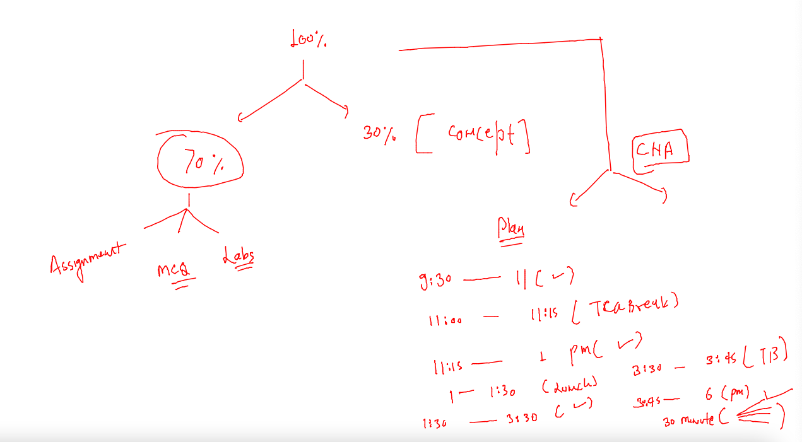

# cisco-CNA-22ndNov2022

## traning plan 



### testing automated Build of docker image on github code commit 

```
[ashu@ip-172-31-16-246 ashu-container-apps]$ cd  ashu-cisco-webUI/
[ashu@ip-172-31-16-246 ashu-cisco-webUI]$ ls
cicd.png  Dockerfile  health.html  index.html  README.md
[ashu@ip-172-31-16-246 ashu-cisco-webUI]$ git add . 
[ashu@ip-172-31-16-246 ashu-cisco-webUI]$ git commit -m "adding health check page"
[master 472b4ac] adding health check page
 1 file changed, 1 insertion(+)
 create mode 100644 health.html
[ashu@ip-172-31-16-246 ashu-cisco-webUI]$ git push 
Enumerating objects: 4, done.
Counting objects: 100% (4/4), done.
Delta compression using up to 2 threads
Compressing objects: 100% (3/3), done.
Writing objects: 100% (3/3), 333 bytes | 333.00 KiB/s, done.
Total 3 (delta 1), reused 0 (delta 0), pack-reused 0
remote: Resolving deltas: 100% (1/1), completed with 1 local object.
To https://github.com/redashu/ashu-cisco-webUI.git
   3c4527a..472b4ac  master -> master
[ashu@ip-172-31-16-246 ashu-cisco-webUI]$ 

```


