# cisco-CNA-22ndNov2022

## traning plan 


### journey 

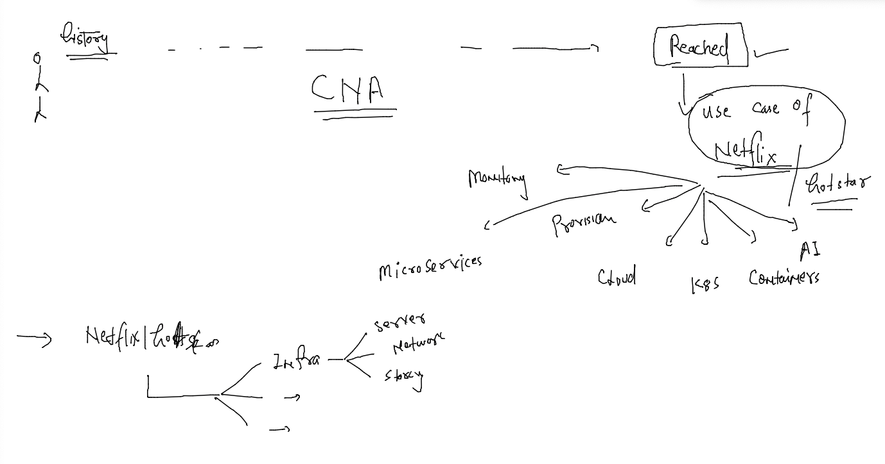

### app deploy problem 


### app conflict problem 

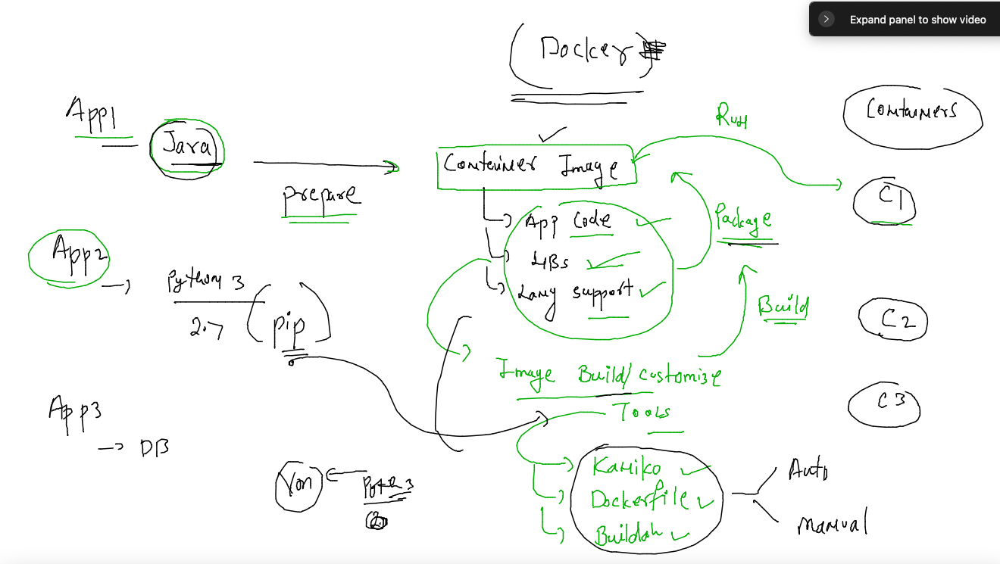

### introduction to Hypervisor for VM concept 

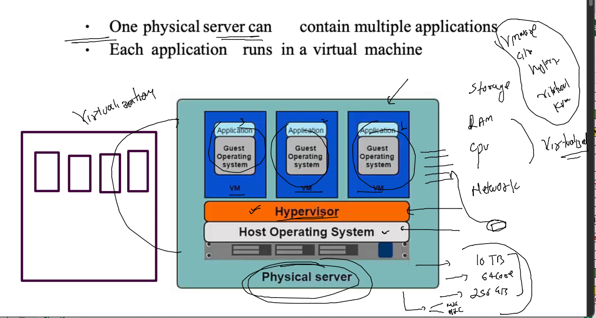

### type 2 Hypervisor 

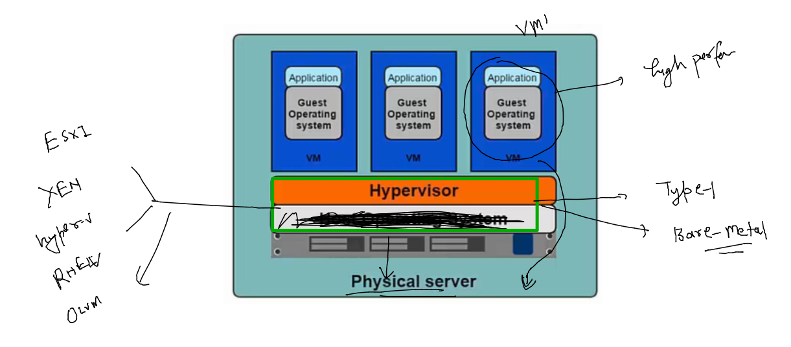

### type 1 hypervisor 

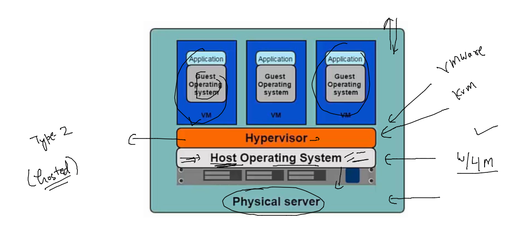

### infra and Hypervisor problems 

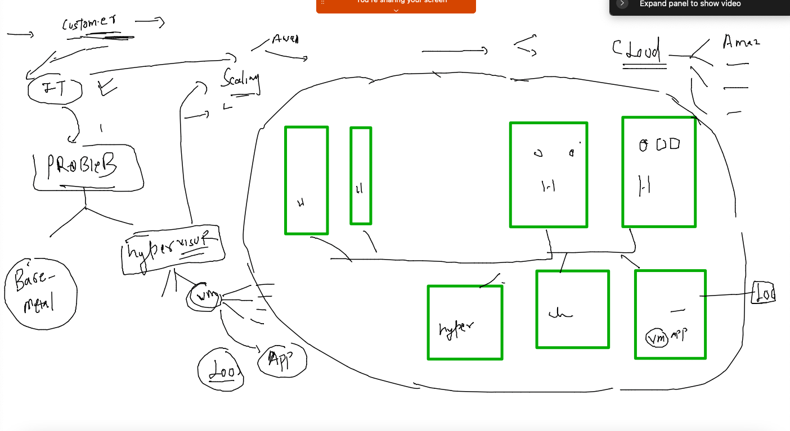

## Cloud Deployment model 

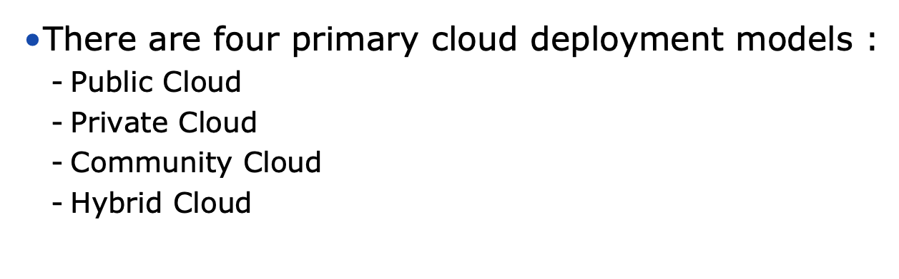

### Public cloud 

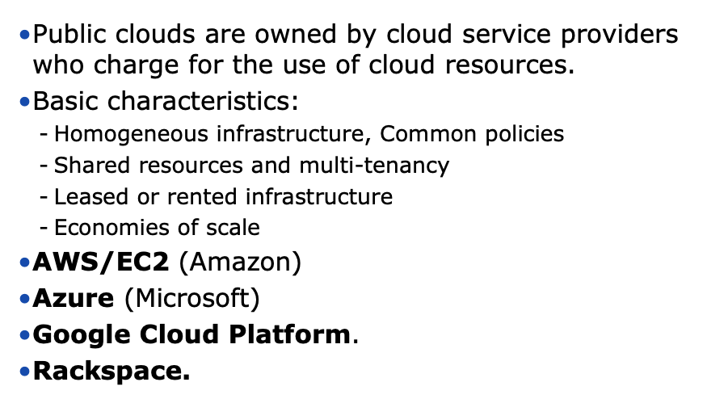

### private cloud model 

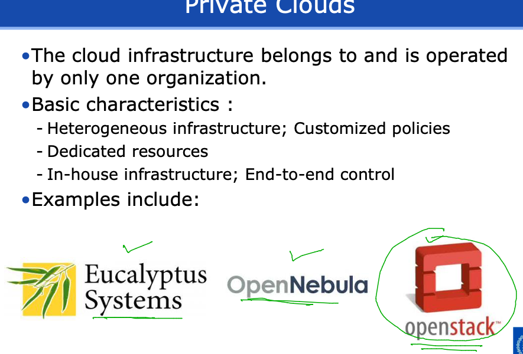


## Cloud Delivery Model 

### SAAS 

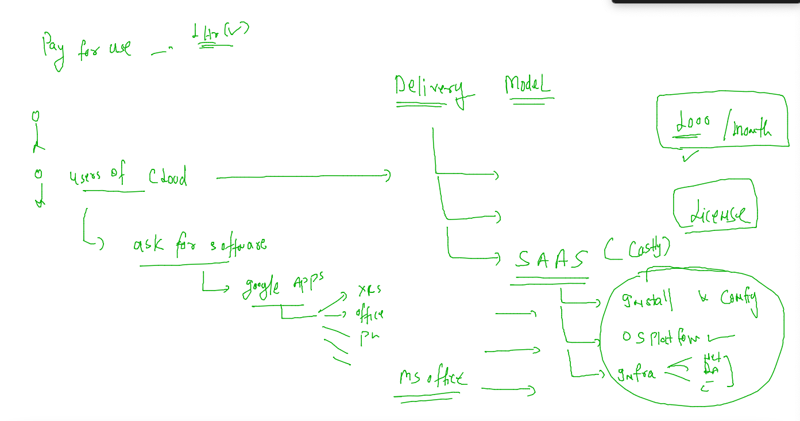

### PAAS 

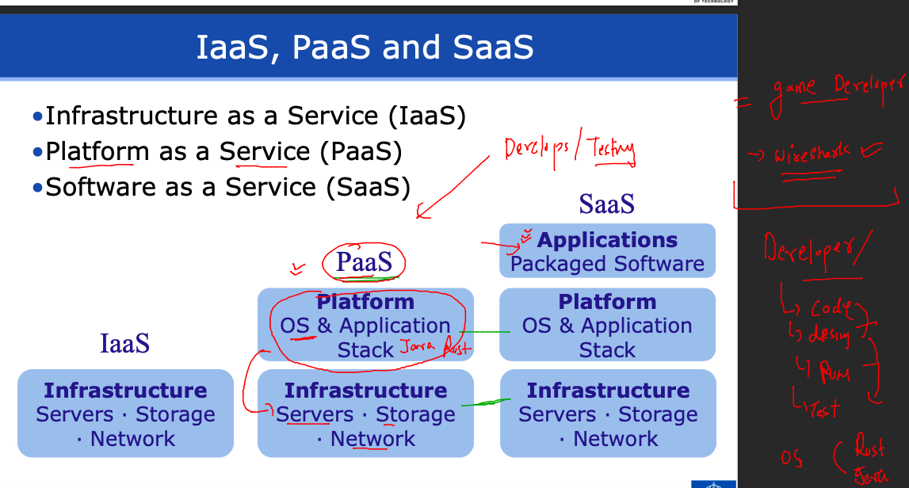

### IAAS 

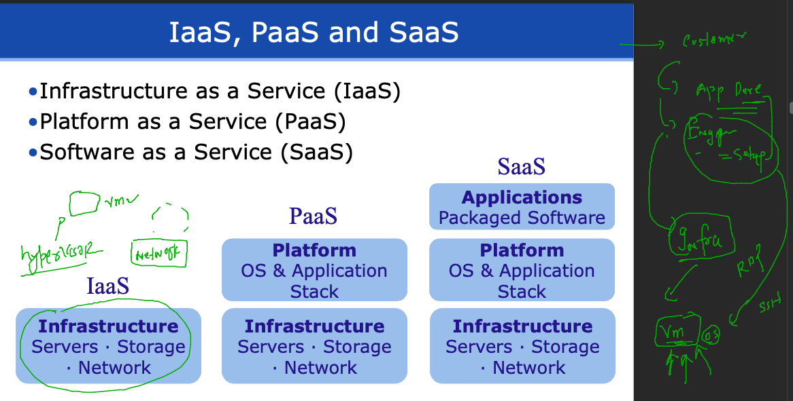

### planning and vm in aws cloud using Ec2 

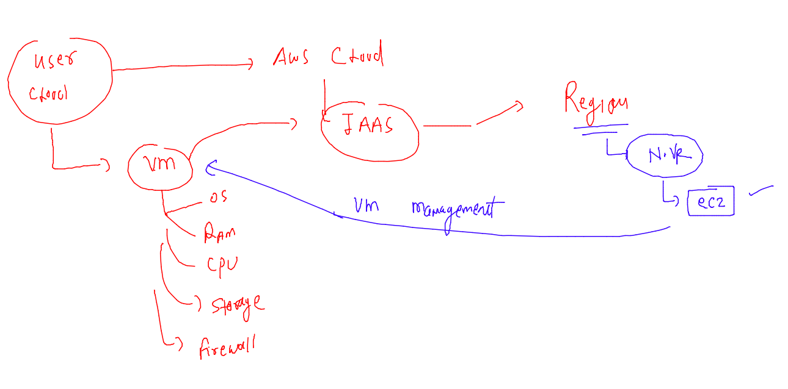

### launched ec2 in aws cloud 

### lets connect using ssh from MAC 

### run this in the terminal 

```
fire@ashutoshhs-MacBook-Air ~ % ls  -l Downloads/ashu-cisco-key.pem 
-rw-r--r--@ 1 fire  staff  1674 Nov 22 12:27 Downloads/ashu-cisco-key.pem
fire@ashutoshhs-MacBook-Air ~ % 
fire@ashutoshhs-MacBook-Air ~ % 
fire@ashutoshhs-MacBook-Air ~ % 
fire@ashutoshhs-MacBook-Air ~ % chmod 400 Downloads/ashu-cisco-key.pem 
fire@ashutoshhs-MacBook-Air ~ % 
fire@ashutoshhs-MacBook-Air ~ % ls  -l Downloads/ashu-cisco-key.pem   
-r--------@ 1 fire  staff  1674 Nov 22 12:27 Downloads/ashu-cisco-key.pem
fire@ashutoshhs-MacBook-Air ~ % 
```

### now connecting 

```
fire@ashutoshhs-MacBook-Air ~ % ssh -i Downloads/ashu-cisco-key.pem  ec2-user@35.174.114.195 
The authenticity of host '35.174.114.195 (35.174.114.195)' can't be established.
ECDSA key fingerprint is SHA256:/bRp+A739JNNN8yhUVURb72ZAlRUT8GSitF2Gsrh1vk.
Are you sure you want to continue connecting (yes/no/[fingerprint])? yes
Warning: Permanently added '35.174.114.195' (ECDSA) to the list of known hosts.

       __|  __|_  )
       _|  (     /   Amazon Linux 2 AMI
      ___|\___|___|

https://aws.amazon.com/amazon-linux-2/
1 package(s) needed for security, out of 1 available
Run "sudo yum update" to apply all updates.
-bash: warning: setlocale: LC_CTYPE: cannot change locale (UTF-8): No such file or directory
[ec2-user@ip-172-31-89-133 ~]$ 
```

### lets check it 

```
fire@ashutoshhs-MacBook-Air ~ % ssh -i Downloads/ashu-cisco-key.pem  ec2-user@35.174.114.195 
Last login: Tue Nov 22 07:11:01 2022 from 103.59.75.139

       __|  __|_  )
       _|  (     /   Amazon Linux 2 AMI
      ___|\___|___|

https://aws.amazon.com/amazon-linux-2/
1 package(s) needed for security, out of 1 available
Run "sudo yum update" to apply all updates.
-bash: warning: setlocale: LC_CTYPE: cannot change locale (UTF-8): No such file or directory
[ec2-user@ip-172-31-89-133 ~]$ 
[ec2-user@ip-172-31-89-133 ~]$ 
[ec2-user@ip-172-31-89-133 ~]$ whoami
ec2-user
[ec2-user@ip-172-31-89-133 ~]$ uname 
Linux
[ec2-user@ip-172-31-89-133 ~]$ uname  -r
5.10.147-133.644.amzn2.x86_64
[ec2-user@ip-172-31-89-133 ~]$ sudo -i
[root@ip-172-31-89-133 ~]# whoami
root
[root@ip-172-31-89-133 ~]# exit
logout
[ec2-user@ip-172-31-89-133 ~]$ exit
logout
Connection to 35.174.114.195 closed.
```

### availability zone 

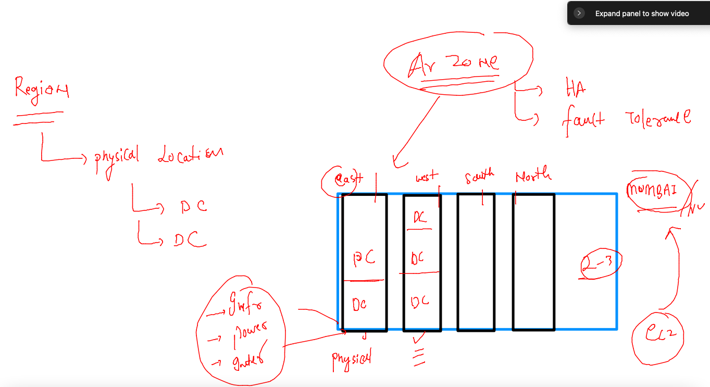

### deploy a sample customer webapp frontend app in aws cloud vm 

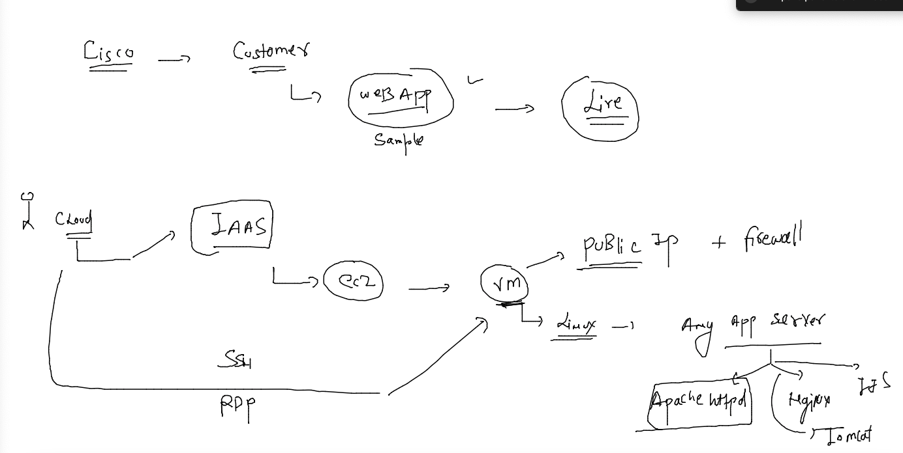

### after login to vm - steps to perform 

```
[ec2-user@ip-172-31-33-192 ~]$ history 
    1  sudo -i
```

###  install httpd and git to host app 

```
 1  yum install git httpd -y 
    2  history 
    3  git clone  https://github.com/schoolofdevops/html-sample-app.git
    4  ls
    5  cp -rf html-sample-app/*  /var/www/html/
    6  systemctl start httpd
    7  ls  /var/www/html/
```
