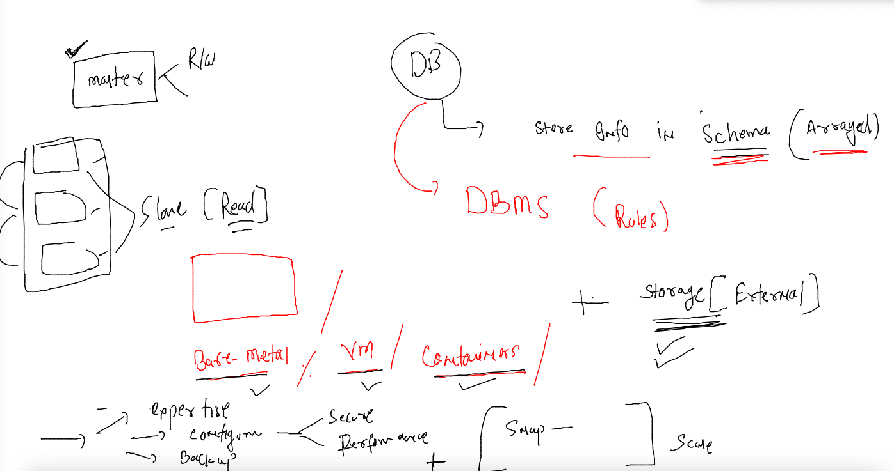
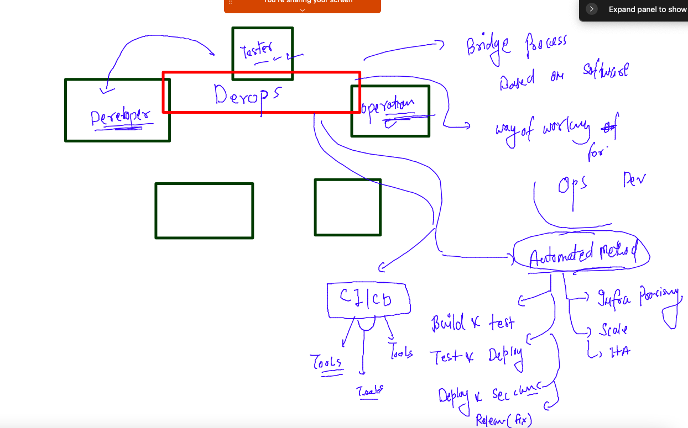
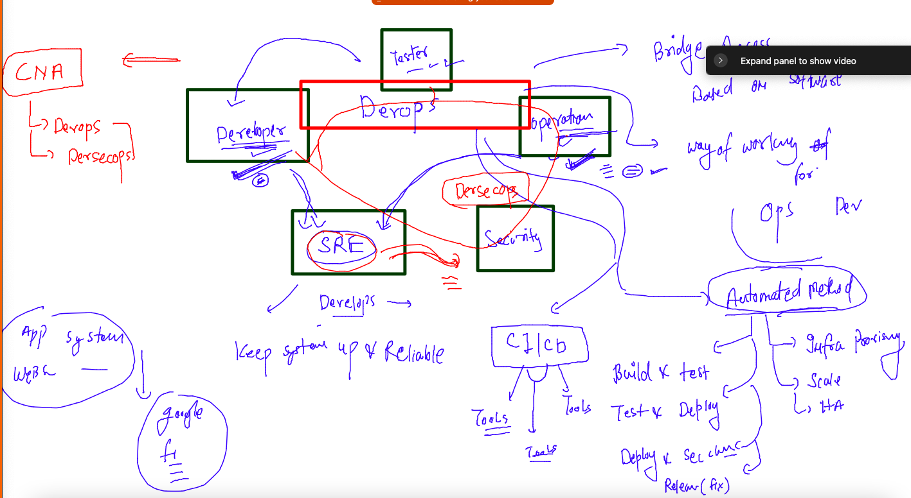

# cisco-CNA-22ndNov2022

## traning plan 


### revision step 1 


### REv step 2 


### k8s networking 


## Deploy app and implement Ingress rule 

### deploying app with UI 

```
[ashu@ip-172-31-16-246 ashu-container-apps]$ kubectl  create  deployment  ashu-app  --image=docker.io/library/adminer:latest --port 8080 --dry-run=client -o yaml >day
4app.yaml 
[ashu@ip-172-31-16-246 ashu-container-apps]$ kubectl  apply -f day4app.yaml 
deployment.apps/ashu-app created
[ashu@ip-172-31-16-246 ashu-container-apps]$ kubectl  get  deploy 
NAME       READY   UP-TO-DATE   AVAILABLE   AGE
ashu-app   1/1     1            1           5s
[ashu@ip-172-31-16-246 ashu-container-apps]$ kubectl  get  po 
NAME                      READY   STATUS    RESTARTS   AGE
ashu-app-f6cc5cd7-sptv6   1/1     Running   0          9s
[ashu@ip-172-31-16-246 ashu-container-apps]$ kubectl  get  po -o wide
NAME                      READY   STATUS    RESTARTS   AGE   IP                NODE      NOMINATED NODE   READINESS GATES
ashu-app-f6cc5cd7-sptv6   1/1     Running   0          14s   192.168.235.143   worker1   <none>           <none>
[ashu@ip-172-31-16-246 ashu-container-apps]$ 
```

## Creating cluster IP type service in k8s 

```
[ashu@ip-172-31-16-246 ashu-container-apps]$ kubectl   get  deploy 
NAME         READY   UP-TO-DATE   AVAILABLE   AGE
ankit-app1   1/1     1            1           22m
ashu-app     1/1     1            1           27m
atul-app     1/1     1            1           26m
leni-app     1/1     1            1           22m
mkj-app      1/1     1            1           25m
teju-app     1/1     1            1           24m
vijay-app    1/1     1            1           23m
[ashu@ip-172-31-16-246 ashu-container-apps]$ kubectl  expose deployment  ashu-app  --type ClusterIP --port 8080 --name ashu-app-lb --dry-run=client -o yaml >applb.yaml
[ashu@ip-172-31-16-246 ashu-container-apps]$ ls
admin.conf  adminer.yaml  applb.yaml  ashu-front-end.yaml  day4app.yaml  dbsvc.yaml  db.yaml  load_bal.yaml  one-page-website-html-css-project  project-html-website
[ashu@ip-172-31-16-246 ashu-container-apps]$ kubectl apply -f applb.yaml 
service/ashu-app-lb created
[ashu@ip-172-31-16-246 ashu-container-apps]$ kubectl   get  service 
NAME          TYPE        CLUSTER-IP      EXTERNAL-IP   PORT(S)    AGE
ashu-app-lb   ClusterIP   10.97.239.123   <none>        8080/TCP   5s
kubernetes    ClusterIP   10.96.0.1       <none>        443/TCP    49m
[ashu@ip-172-31-16-246 ashu-container-apps]$ 
```

### ingress rule yaml 

```
apiVersion: networking.k8s.io/v1
kind: Ingress
metadata:
  name: ashu-app-route-rule # name of rule 
  annotations:
    nginx.ingress.kubernetes.io/rewrite-target: /
spec:
  ingressClassName: nginx # class name of Ingress -- example , nginx , haproxy , istio
  rules:
  - host: me.ashutoshh.in # domain name to check by ingress rule 
    http:
      paths:
      - path: / # home page means / 
        pathType: Prefix
        backend:
          service:
            name: ashu-app-lb # name of service 
            port:
              number: 8080 # internal service name 
```

### Deploy and check 

```
[ashu@ip-172-31-16-246 ashu-container-apps]$ kubectl apply -f ashu-ingress-rule.yaml 
ingress.networking.k8s.io/ashu-app-route-rule created
[ashu@ip-172-31-16-246 ashu-container-apps]$ kubectl  get  ingress
NAME                  CLASS   HOSTS             ADDRESS   PORTS   AGE
ashu-app-route-rule   nginx   me.ashutoshh.in             80      10s
[ashu@ip-172-31-16-246 ashu-container-apps]$ kubectl  get  ingress
NAME                  CLASS   HOSTS             ADDRESS   PORTS   AGE
ashu-app-route-rule   nginx   me.ashutoshh.in             80      26s
[ashu@ip-172-31-16-246 ashu-container-apps]$ kubectl  get  ingress
NAME                  CLASS   HOSTS             ADDRESS         PORTS   AGE
ashu-app-route-rule   nginx   me.ashutoshh.in   172.31.39.221   80      76s
[ashu@ip-172-31-16-246 ashu-container-apps]$ 

```

### autoscale -- pod -replica 

```
[ashu@ip-172-31-16-246 ashu-container-apps]$ kubectl  autoscale deployment ashu-app  --cpu-percent=70  --min=3 --max=20 --dry-run=client  -o yaml >ashu_app_autoscale.yaml 
[ashu@ip-172-31-16-246 ashu-container-apps]$ kubectl get deploy 
NAME         READY   UP-TO-DATE   AVAILABLE   AGE
ankit-app1   1/1     1            1           55m
ashu-app     1/1     1            1           60m
atul-app     1/1     1            1           58m
leni-app     1/1     1            1           55m
mkj-app      1/1     1            1           58m
teju-app     1/1     1            1           57m
vijay-app    1/1     1            1           56m
[ashu@ip-172-31-16-246 ashu-container-apps]$ kubectl  apply -f ashu_app_autoscale.yaml 
horizontalpodautoscaler.autoscaling/ashu-app created
[ashu@ip-172-31-16-246 ashu-container-apps]$ kubectl  get  hpa
NAME       REFERENCE             TARGETS         MINPODS   MAXPODS   REPLICAS   AGE
ashu-app   Deployment/ashu-app   <unknown>/70%   3         20        0          7s
[ashu@ip-172-31-16-246 ashu-container-apps]$ kubectl  get  hpa
NAME         REFERENCE               TARGETS         MINPODS   MAXPODS   REPLICAS   AGE
ankit-app1   Deployment/ankit-app1   <unknown>/70%   3         20        1          16s
ashu-app     Deployment/ashu-app     <unknown>/70%   3         20        1          24s
```

### Understanding DB problem 



### creating External Name service to access outside k8s Resources like Database 

```
[ashu@ip-172-31-16-246 ashu-container-apps]$ kubectl create  service externalname  ashu-db-lb  --external-name cisco-db.c6lnrmxmads2.ap-south-1.rds.amazonaws.com  --tcp 3306:3306  --dry-run=client -o yaml 
apiVersion: v1
kind: Service
metadata:
  creationTimestamp: null
  labels:
    app: ashu-db-lb
  name: ashu-db-lb
spec:
  externalName: cisco-db.c6lnrmxmads2.ap-south-1.rds.amazonaws.com
  ports:
  - name: 3306-3306
    port: 3306
    protocol: TCP
    targetPort: 3306
  selector:
    app: ashu-db-lb
  type: ExternalName
status:
  loadBalancer: {}
[ashu@ip-172-31-16-246 ashu-container-apps]$ kubectl create  service externalname  ashu-db-lb  --external-name cisco-db.c6lnrmxmads2.ap-south-1.rds.amazonaws.com  --tcp 3306:3306  --dry-run=client -o yaml  >externalsvc.yaml
```

### lets modify things 

```
apiVersion: v1
kind: Service
metadata:
  creationTimestamp: null
  labels:
    app: ashu-db-lb
  name: ashu-db-lb
spec:
  externalName: cisco-db.c6lnrmxmads2.ap-south-1.rds.amazonaws.com
  ports:
  - name: 3306-3306
    port: 3306
    protocol: TCP
    targetPort: 3306
  #selector: # remove / comment this field 
  #  app: ashu-db-lb
  type: ExternalName
  sessionAffinity: ClientIP # session sticky from Multi Pod to external DB 
status:
  loadBalancer: {}

```

### creating it

```
[ashu@ip-172-31-16-246 ashu-container-apps]$ kubectl apply -f externalsvc.yaml 
service/ashu-db-lb created
[ashu@ip-172-31-16-246 ashu-container-apps]$ kubectl  get  svc 
NAME           TYPE           CLUSTER-IP       EXTERNAL-IP                                          PORT(S)    AGE
ankit-app-lb   ClusterIP      10.106.233.213   <none>                                               8080/TCP   156m
ashu-app-lb    ClusterIP      10.97.239.123    <none>                                               8080/TCP   160m
ashu-db-lb     ExternalName   <none>           cisco-db.c6lnrmxmads2.ap-south-1.rds.amazonaws.com   3306/TCP   9s
atul-app-lb    ClusterIP      10.102.151.53    <none>                                               8080/TCP   159m
kubernetes     ClusterIP      10.96.0.1        <none>                                               443/TCP    3h29m
leni-app-lb    ClusterIP      10.108.74.24     <none>                                               8080/TCP   155m
mkj-app-lb     ClusterIP      
```
### even after CNA and many other technology we need time to implement and co-ordinate things 


### Introduction Devops 



### DEvops | SRE | DevsecOPS




