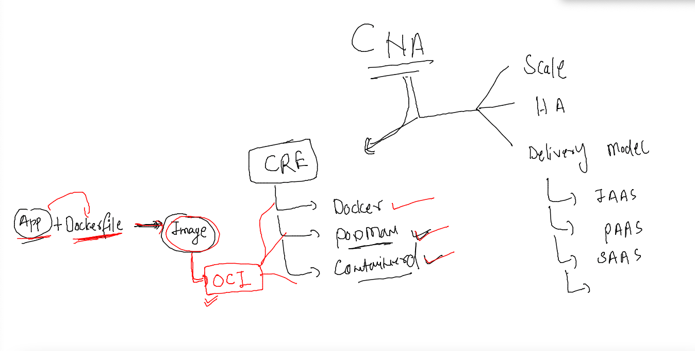
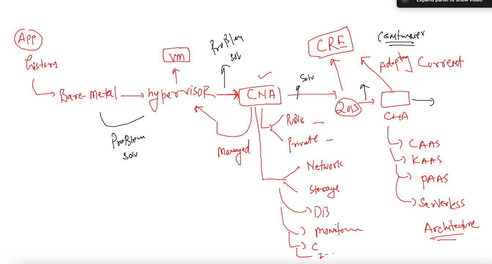
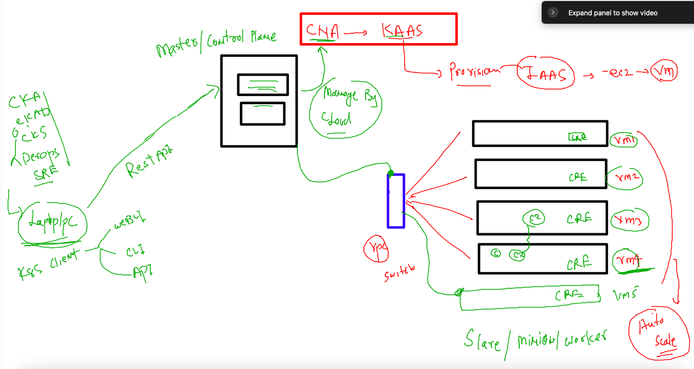
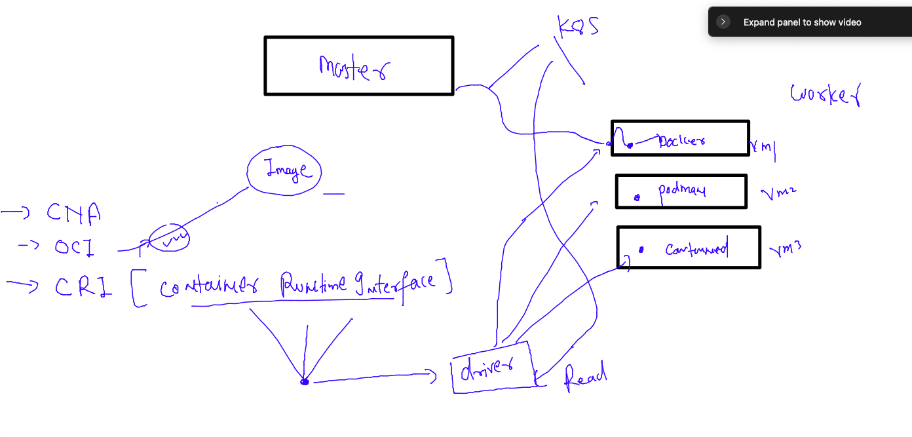
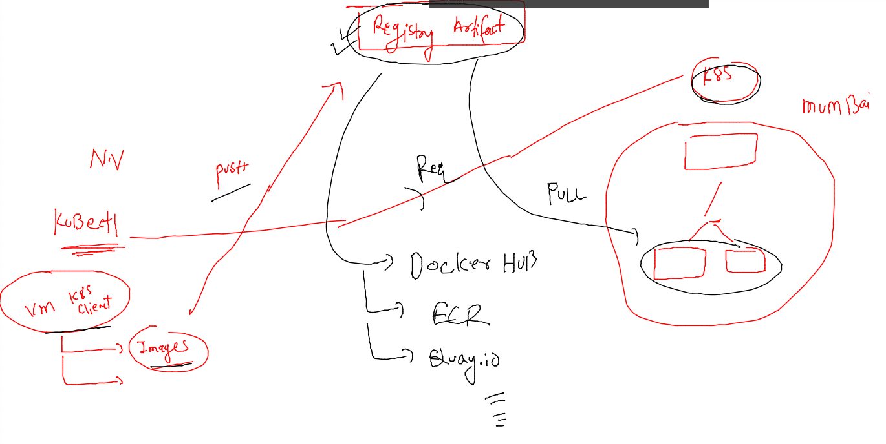
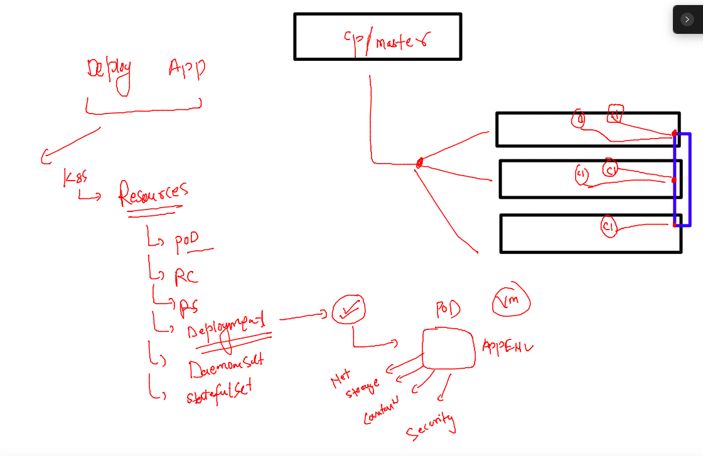
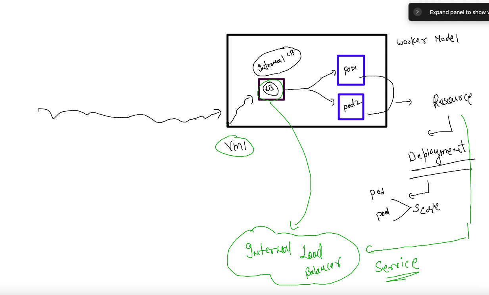

# cisco-CNA-22ndNov2022

## traning plan 


### login and create folder in Docker server 

```
fire@ashutoshhs-MacBook-Air ~ % ssh ashu@54.145.245.225
ashu@54.145.245.225's password: 
Last login: Tue Nov 22 11:48:42 2022 from 103.59.75.139

       __|  __|_  )
       _|  (     /   Amazon Linux 2 AMI
      ___|\___|___|

https://aws.amazon.com/amazon-linux-2/
1 package(s) needed for security, out of 1 available
Run "sudo yum update" to apply all updates.
-bash: warning: setlocale: LC_CTYPE: cannot change locale (UTF-8): No such file or directory
[ashu@ip-172-31-16-246 ~]$ 
[ashu@ip-172-31-16-246 ~]$ 
[ashu@ip-172-31-16-246 ~]$ docker  ps 
CONTAINER ID   IMAGE     COMMAND   CREATED   STATUS    PORTS     NAMES
[ashu@ip-172-31-16-246 ~]$ ls  /home
ankit  ashu  atul  ec2-user  leni  manash  teja  vijay  vijayk
[ashu@ip-172-31-16-246 ~]$ who
ashu     pts/0        Nov 23 04:24 (103.59.75.139)
vijayk   pts/1        Nov 23 04:24 (72.163.220.6)
atul     pts/2        Nov 23 04:24 (72.163.220.1)
manash   pts/3        Nov 23 04:24 (72.163.220.25)
[ashu@ip-172-31-16-246 ~]$ whoami
ashu
[ashu@ip-172-31-16-246 ~]$ pwd
/home/ashu
[ashu@ip-172-31-16-246 ~]$ mkdir ashu-container-apps
[ashu@ip-172-31-16-246 ~]$ ls
ashu-container-apps  project-website-template
[ashu@ip-172-31-16-246 ~]$ 

```

### app to container image using dockerfile 

```
git clone https://github.com/ShaifArfan/one-page-website-html-css-project.git

```

### Dockerfile 

```
FROM oraclelinux:8.4 
# taking base os library 
LABEL name=ashutoshh
LABEL email=ashutoshh@linux.com
# optional field but you can share details of image developer
RUN yum install httpd -y 
COPY . /var/www/html/
CMD ["httpd","-DFOREGROUND"]

```

### lets build it 

```
[ashu@ip-172-31-16-246 ashu-container-apps]$ ls
one-page-website-html-css-project  project-html-website
[ashu@ip-172-31-16-246 ashu-container-apps]$ cd one-page-website-html-css-project/
[ashu@ip-172-31-16-246 one-page-website-html-css-project]$ ls
app.js  Dockerfile  img  index.html  LICENSE  README.md  style.css
[ashu@ip-172-31-16-246 one-page-website-html-css-project]$ docker build -t  ashuapp:v1  . 
Sending build context to Docker daemon  793.6kB
Step 1/6 : FROM oraclelinux:8.4
8.4: Pulling from library/oraclelinux
a4df6f21af84: Pull complete 
Digest: sha256:b81d5b0638bb67030b207d28586d0e714a811cc612396dbe3410db406998b3ad
Status: Downloaded newer image for oraclelinux:8.4
 ---> 97e22ab49eea
Step 2/6 : LABEL name=ashutoshh
 ---> Running in c8347d7f5cb8
Removing intermediate container c8347d7f5cb8
 ---> c944ba9ec483
Step 3/6 : LABEL email=ashutoshh@linux.com
 ---> Running in 3b2c0e9c3d13
Removing intermediate container 3b2c0e9c3d13
 ---> 693774e81fba
Step 4/6 : RUN yum install httpd -y
 ---> Running in 16be39a07e1a
Oracle Linux 8 BaseOS Latest (x86_64)    
```

### lets check the images 

```
[ashu@ip-172-31-16-246 one-page-website-html-css-project]$ docker  images
REPOSITORY    TAG       IMAGE ID       CREATED          SIZE
<none>        <none>    758535f922f3   33 seconds ago   246MB
vijaypapp     v1        5ccb531b3861   2 minutes ago    456MB
tejuapp       v1        504b45cd0abd   3 minutes ago    456MB
leniapp       v1        e3577d96eaf1   4 minutes ago    456MB
atulapp       v1        a0a5e78726d0   4 minutes ago    456MB
ashuapp       v1        71ad8d760ee9   5 minutes ago    456MB
nginx         latest    88736fe82739   7 days ago       142MB
oraclelinux   8.4       97e22ab49eea   12 months ago    246MB
[ashu@ip-172-31-16-246 one-page-website-html-css-project]$ 
```

### creating container from this image 

```
[ashu@ip-172-31-16-246 one-page-website-html-css-project]$ docker run -itd --name ashuwebapp1 -p 1234:80 ashuapp:v1  
34b393c7c67249d20829c24a3634abbe8b4e0d38f5ddd3a54296f84a8aae83f0
[ashu@ip-172-31-16-246 one-page-website-html-css-project]$ docker ps
CONTAINER ID   IMAGE        COMMAND                CREATED         STATUS         PORTS                                   NAMES
34b393c7c672   ashuapp:v1   "httpd -DFOREGROUND"   4 seconds ago   Up 3 seconds   0.0.0.0:1234->80/tcp, :::1234->80/tcp   ashuwebapp1
```

### Understanding one More CNA -- standard for container images -- OCI 



### journey of application Design and deployment 



## k8s and CLoud nativ kubernetes 



### COntainer RUNTIME Interface 



### Pushing image to Registry server 



### pushing image to container registry -Docker hub 

```
[ashu@ip-172-31-16-246 ashu-container-apps]$ docker  tag  ashuapp:v1   docker.io/dockerashu/ashuapp:v1  
[ashu@ip-172-31-16-246 ashu-container-apps]$ 
[ashu@ip-172-31-16-246 ashu-container-apps]$ 
[ashu@ip-172-31-16-246 ashu-container-apps]$ docker login 
Login with your Docker ID to push and pull images from Docker Hub. If you don't have a Docker ID, head over to https://hub.docker.com to create one.
Username: dockerashu
Password: 
WARNING! Your password will be stored unencrypted in /home/ashu/.docker/config.json.
Configure a credential helper to remove this warning. See
https://docs.docker.com/engine/reference/commandline/login/#credentials-store

Login Succeeded
[ashu@ip-172-31-16-246 ashu-container-apps]$ docker push docker.io/dockerashu/ashuapp:v1 
The push refers to repository [docker.io/dockerashu/ashuapp]
7ce885c8fb74: Pushed 
8402448e869e: Pushed 
2d3586eacb61: Mounted from library/oraclelinux 
v1: digest: sha256:0b75085a73b2ec906b294827a51517b3c32024b4891dcf554f4f386e164ada80 size: 952
[ashu@ip-172-31-16-246 ashu-container-apps]$ 
[ashu@ip-172-31-16-246 ashu-container-apps]$ 
[ashu@ip-172-31-16-246 ashu-container-apps]$ docker logout 
Removing login credentials for https://index.docker.io/v1/
```


## K8s client -- sending Request to control plane 

```
[ashu@ip-172-31-16-246 ashu-container-apps]$ kubectl  get  nodes 
The connection to the server localhost:8080 was refused - did you specify the right host or port?
[ashu@ip-172-31-16-246 ashu-container-apps]$ 
[ashu@ip-172-31-16-246 ashu-container-apps]$ kubectl  get  nodes   --kubeconfig admin.conf 
NAME            STATUS   ROLES           AGE   VERSION
control-plane   Ready    control-plane   35d   v1.25.3
worker1         Ready    <none>          35d   v1.25.3
worker2         Ready    <none>          35d   v1.25.3
[ashu@ip-172-31-16-246 ashu-container-apps]$ 
```

### supply admin.conf option 

```
[ashu@ip-172-31-16-246 ashu-container-apps]$ kubectl   cluster-info --kubeconfig admin.conf 
Kubernetes control plane is running at https://3.111.75.5:6443
CoreDNS is running at https://3.111.75.5:6443/api/v1/namespaces/kube-system/services/kube-dns:dns/proxy

To further debug and diagnose cluster problems, use 'kubectl cluster-info dump'.
[ashu@ip-172-31-16-246 ashu-container-apps]$ 

```

### fixing the location of k8s cluster conf file 

```
[ashu@ip-172-31-16-246 ashu-container-apps]$ cp -v  admin.conf  ~/.kube/config 
‘admin.conf’ -> ‘/home/ashu/.kube/config’
[ashu@ip-172-31-16-246 ashu-container-apps]$ 
[ashu@ip-172-31-16-246 ashu-container-apps]$ kubectl   get  nodes
NAME            STATUS   ROLES           AGE   VERSION
control-plane   Ready    control-plane   35d   v1.25.3
worker1         Ready    <none>          35d   v1.25.3
worker2         Ready    <none>          35d   v1.25.3
[ashu@ip-172-31-16-246 ashu-container-apps]$ kubectl cluster-info 
Kubernetes control plane is running at https://3.111.75.5:6443
CoreDNS is running at https://3.111.75.5:6443/api/v1/namespaces/kube-system/services/kube-dns:dns/proxy

To further debug and diagnose cluster problems, use 'kubectl cluster-info dump'.
```

### understanding deployment resources of any app in k8s 



### creating deployment file and deploy it on k8s cluster 

```
 kubectl  create deployment  ashuweb-front-end --image=docker.io/dockerashu/ashuapp:v1  --port 80 --dry-run=client -o yaml    >ashu-front-end.yaml
```

### lets deploy it 

```
kubectl apply -f ashu-front-end.yaml 
[ashu@ip-172-31-16-246 ashu-container-apps]$ kubectl   get  deploy
NAME                READY   UP-TO-DATE   AVAILABLE   AGE
ashuweb-front-end   1/1     1            1           65s
mkjweb-front-end    0/1     1            0           8s
```
### checking pod distribution over worker node 

```
[ashu@ip-172-31-16-246 ashu-container-apps]$ kubectl   get  deploy
NAME                READY   UP-TO-DATE   AVAILABLE   AGE
ashuweb-front-end   1/1     1            1           65s
mkjweb-front-end    0/1     1            0           8s
[ashu@ip-172-31-16-246 ashu-container-apps]$ kubectl   get  deploy
NAME                READY   UP-TO-DATE   AVAILABLE   AGE
ashuweb-front-end   1/1     1            1           82s
mkjweb-front-end    1/1     1            1           25s
[ashu@ip-172-31-16-246 ashu-container-apps]$ kubectl   get  pods
NAME                                 READY   STATUS    RESTARTS   AGE
ashuweb-front-end-656fb5f6d7-sjmmf   1/1     Running   0          2m45s
atulweb-front-end-dcc5486c8-qmbnd    1/1     Running   0          51s
mkjweb-front-end-6dbf67bffd-qrxxz    1/1     Running   0          108s
visweb-frontend-68ff5df788-w68wz     1/1     Running   0          50s
[ashu@ip-172-31-16-246 ashu-container-apps]$ kubectl   get  pods -o wide
NAME                                 READY   STATUS    RESTARTS   AGE     IP                NODE      NOMINATED NODE   READINESS GATES
ashuweb-front-end-656fb5f6d7-sjmmf   1/1     Running   0          2m56s   192.168.235.154   worker1   <none>           <none>
atulweb-front-end-dcc5486c8-qmbnd    1/1     Running   0          62s     192.168.235.155   worker1   <none>           <none>
mkjweb-front-end-6dbf67bffd-qrxxz    1/1     Running   0          119s    192.168.235.152   worker1   <none>           <none>
visweb-frontend-68ff5df788-w68wz     1/1     Running   0          61s     192.168.189.102   worker2   <none>           <none>
[ashu@ip-172-31-16-246 ashu-container-apps]$ 
[ashu@ip-172-31-16-246 ashu-container-apps]$ 
[ashu@ip-172-31-16-246 ashu-container-apps]$ kubectl  get nodes
NAME            STATUS   ROLES           AGE   VERSION
control-plane   Ready    control-plane   35d   v1.25.3
worker1         Ready    <none>          35d   v1.25.3
worker2         Ready    <none>          35d   v1.25.3
[ashu@ip-172-31-16-246 ashu-container-apps]$ 
```

### scaling pod horizentally using deployment 

```
[ashu@ip-172-31-16-246 ashu-container-apps]$ kubectl   get  deploy 
NAME                  READY   UP-TO-DATE   AVAILABLE   AGE
ashuweb-front-end     1/1     1            1           9m14s
atulweb-front-end     1/1     1            1           7m20s
mkjweb-front-end      1/1     1            1           8m17s
vijaypweb-front-end   1/1     1            1           2m24s
visweb-frontend       1/1     1            1           7m19s
[ashu@ip-172-31-16-246 ashu-container-apps]$ kubectl  scale deployment ashuweb-front-end  --replicas=3
deployment.apps/ashuweb-front-end scaled
[ashu@ip-172-31-16-246 ashu-container-apps]$ kubectl   get  deploy 
NAME                  READY   UP-TO-DATE   AVAILABLE   AGE
ashuweb-front-end     2/3     3            2           11m
atulweb-front-end     1/1     1            1           9m40s
mkjweb-front-end      1/1     1            1           10m
vijaypweb-front-end   1/1     1            1           4m44s
visweb-frontend       1/1     1            1           9m39s
[ashu@ip-172-31-16-246 ashu-container-apps]$ kubectl   get  deploy 
NAME                  READY   UP-TO-DATE   AVAILABLE   AGE
ashuweb-front-end     3/3     3            3           11m
atulweb-front-end     1/1     1            1           9m44s
mkjweb-front-end      1/1     1            1           10m
vijaypweb-front-end   1/1     1            1           4m48s
visweb-frontend       1/1     1            1           9m43s
[ashu@ip-172-31-16-246 ashu-container-apps]$ kubectl   get po -o wide
NAME                                  READY   STATUS    RESTARTS   AGE     IP                NODE      NOMINATED NODE   READINESS GATES
ashuweb-front-end-656fb5f6d7-hjqf8    1/1     Running   0          16s     192.168.189.92    worker2   <none>           <none>
ashuweb-front-end-656fb5f6d7-sjmmf    1/1     Running   0          11m     192.168.235.154   worker1   <none>           <none>
ashuweb-front-end-656fb5f6d7-vbpqh    1/1     Running   0          16s     192.168.235.159   worker1   <none>           <none>
atulweb-front-end-dcc5486c8-qmbnd     1/1   
```
### deploy webapp 

```
[ashu@ip-172-31-16-246 ashu-container-apps]$ kubectl  create  deployment  ashu-app-web  --image=adminer --port 8080 --dry-run=client -o yaml >adminer.yaml 
[ashu@ip-172-31-16-246 ashu-container-apps]$ kubectl  apply -f adminer.yaml 
deployment.apps/ashu-app-web created
[ashu@ip-172-31-16-246 ashu-container-apps]$ kubectl   get  deploy 
NAME                  READY   UP-TO-DATE   AVAILABLE   AGE
ankitweb-front-end    1/1     1            1           32m
ashu-app-web          0/1     1            0           4s
atulcluster           2/2     2            2           25m
leniweb-front-end     0/1     1            0           14m
mkjadmnr              2/2     2            2           22m
tejuweb-front-end     3/3     3            3           33m
vijaypweb-front-end   2/2     2            2           18m
visadminer-1          2/2     2            2           25m
[ashu@ip-172-31-16-246 ashu-container-apps]$ kubectl scale deployment ashu-app-web --replicas=2
deployment.apps/ashu-app-web scaled
[ashu@ip-172-31-16-246 ashu-container-apps]$ kubectl   get  deploy 
NAME                  READY   UP-TO-DATE   AVAILABLE   AGE
ankitweb-front-end    1/1     1            1           32m
ashu-app-web          2/2     2            2           58s
```

### creating internal LB in k8s using Service Resources 



### creating service 

```
[ashu@ip-172-31-16-246 ashu-container-apps]$ kubectl  expose deployment ashu-app-web  --type LoadBalancer --port 8080 --dry-run=client -o yaml >load_bal.yaml
[ashu@ip-172-31-16-246 ashu-container-apps]$ kubectl  apply -f load_bal.yaml 
service/ashu-app-web created
[ashu@ip-172-31-16-246 ashu-container-apps]$ kubectl   get  service 
NAME           TYPE           CLUSTER-IP       EXTERNAL-IP   PORT(S)          AGE
ashu-app-web   LoadBalancer   10.100.207.138   <pending>     8080:32371/TCP   10s
kubernetes     ClusterIP      10.96.0.1        <none>        443/TCP          61m
[ashu@ip-172-31-16-246 ashu-container-apps]$ 

```

### creating db using YAML in k8s pod 

```
apiVersion: apps/v1
kind: Deployment
metadata:
  creationTimestamp: null
  labels:
    app: ashu-db
  name: ashu-db
spec:
  replicas: 1
  selector:
    matchLabels:
      app: ashu-db
  strategy: {}
  template:
    metadata:
      creationTimestamp: null
      labels:
        app: ashu-db
    spec:
      containers:
      - image: docker.io/dockerashu/ashudb:1.0
        name: ashudb
        ports:
        - containerPort: 3306
        env: # to set some values in deployment 
        - name: MYSQL_ROOT_PASSWORD
          value: "Cisco@098#"
        resources: {}
status: {}

```

### lets deploy it 

```
ashu@ip-172-31-16-246 ashu-container-apps]$ kubectl   get  deploy  |   grep ashu
ashu-app-web          2/2     2            2           76m
ashu-db               1/1     1            1           3m30s
[ashu@ip-172-31-16-246 ashu-container-apps]$ kubectl   get po  |   grep ashu
ashu-app-web-9796fb4f8-2db5n           1/1     Running            0              76m
ashu-app-web-9796fb4f8-bw745           1/1     Running            0              76m
ashu-db-7767855ddd-pq2kj               1/1     Running            0              32s
[ashu@ip-172-31-16-246 ashu-container-apps]$ 


```

### creating service for DB type 

```
[ashu@ip-172-31-16-246 ashu-container-apps]$ kubectl   get  deploy  |   grep ashu
ashu-app-web          2/2     2            2           82m
ashu-db               1/1     1            1           9m17s
[ashu@ip-172-31-16-246 ashu-container-apps]$ kubectl  expose deploy ashu-db --type ClusterIP --port 3306 --dry-run=client -o yaml >dbsvc.yaml 
[ashu@ip-172-31-16-246 ashu-container-apps]$ kubectl apply -f dbsvc.yaml 
service/ashu-db created
[ashu@ip-172-31-16-246 ashu-container-apps]$ kubectl  get  svc |  grep ashu
ashu-app-web          LoadBalancer   10.100.207.138   <pending>     8080:32371/TCP   73m
ashu-db               ClusterIP      10.111.115.239   <none>        3306/TCP         6s
[ashu@ip-172-31-16-246 ashu-container-apps]$ 

```


