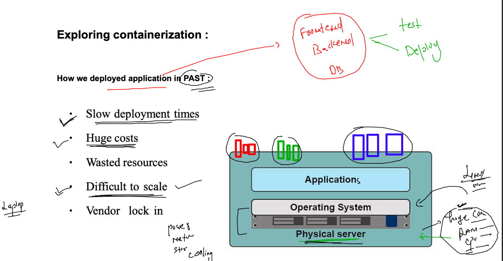

# cisco-CNA-22ndNov2022

## traning plan 


### journey 


### app deploy problem 



### app conflict problem 


### introduction to Hypervisor for VM concept 


### type 2 Hypervisor 


### type 1 hypervisor 


### infra and Hypervisor problems 


## Cloud Deployment model 


### Public cloud 


### private cloud model 


## Cloud Delivery Model 

### SAAS 


### PAAS 


### IAAS 


### planning and vm in aws cloud using Ec2 


### launched ec2 in aws cloud 

### lets connect using ssh from MAC 

### run this in the terminal 

```
fire@ashutoshhs-MacBook-Air ~ % ls  -l Downloads/ashu-cisco-key.pem 
-rw-r--r--@ 1 fire  staff  1674 Nov 22 12:27 Downloads/ashu-cisco-key.pem
fire@ashutoshhs-MacBook-Air ~ % 
fire@ashutoshhs-MacBook-Air ~ % 
fire@ashutoshhs-MacBook-Air ~ % 
fire@ashutoshhs-MacBook-Air ~ % chmod 400 Downloads/ashu-cisco-key.pem 
fire@ashutoshhs-MacBook-Air ~ % 
fire@ashutoshhs-MacBook-Air ~ % ls  -l Downloads/ashu-cisco-key.pem   
-r--------@ 1 fire  staff  1674 Nov 22 12:27 Downloads/ashu-cisco-key.pem
fire@ashutoshhs-MacBook-Air ~ % 
```

### now connecting 

```
fire@ashutoshhs-MacBook-Air ~ % ssh -i Downloads/ashu-cisco-key.pem  ec2-user@35.174.114.195 
The authenticity of host '35.174.114.195 (35.174.114.195)' can't be established.
ECDSA key fingerprint is SHA256:/bRp+A739JNNN8yhUVURb72ZAlRUT8GSitF2Gsrh1vk.
Are you sure you want to continue connecting (yes/no/[fingerprint])? yes
Warning: Permanently added '35.174.114.195' (ECDSA) to the list of known hosts.

       __|  __|_  )
       _|  (     /   Amazon Linux 2 AMI
      ___|\___|___|

https://aws.amazon.com/amazon-linux-2/
1 package(s) needed for security, out of 1 available
Run "sudo yum update" to apply all updates.
-bash: warning: setlocale: LC_CTYPE: cannot change locale (UTF-8): No such file or directory
[ec2-user@ip-172-31-89-133 ~]$ 
```

